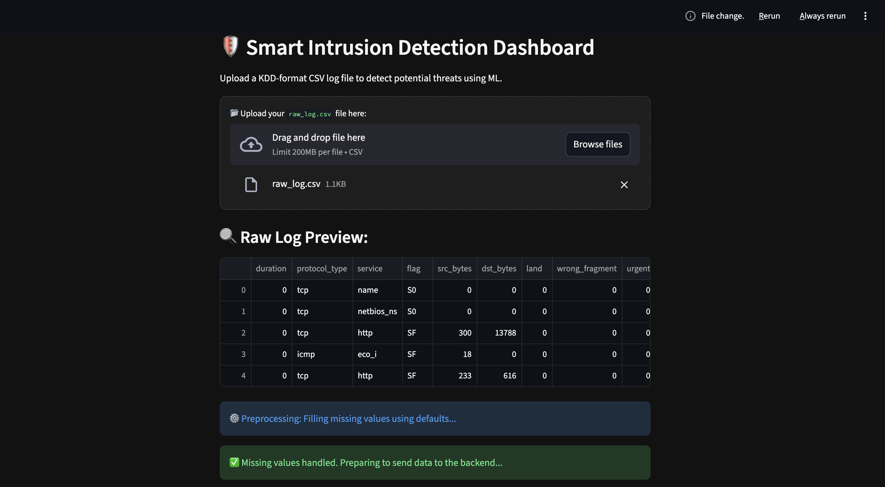
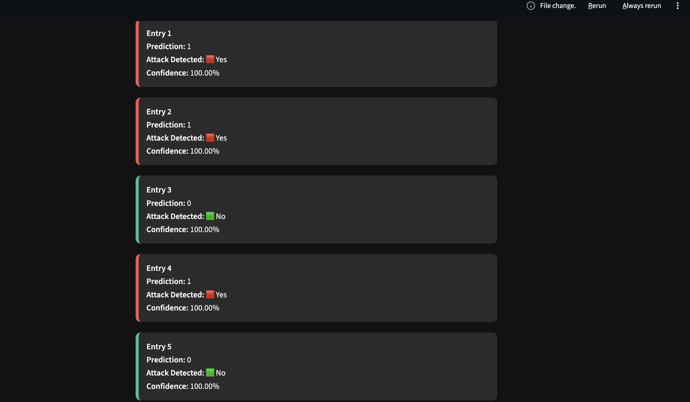

# 🛡️ Smart Intrusion Detection System

A machine learning-based intrusion detection system that detects malicious network traffic using the NSL-KDD dataset. The system uses a trained Random Forest model and provides real-time predictions through a Flask backend and Streamlit dashboard.

---

## 🚀 Features

- Detects network intrusions (attack vs normal traffic)
- Machine learning model trained on NSL-KDD dataset
- Real-time prediction using Flask API
- Interactive Streamlit dashboard for visualization
- Handles raw CSV network logs
- Displays prediction confidence for each entry

---

## 🧠 Tech Stack

- Python
- Scikit-learn (Random Forest)
- Flask (Backend API)
- Streamlit (Frontend Dashboard)
- Pandas, NumPy
- Joblib

---

## ⚙️ Project Architecture

```
CSV Log File
      ↓
Preprocessing (handling missing values)
      ↓
Flask API (Model Inference)
      ↓
Random Forest Model
      ↓
Prediction Output
      ↓
Streamlit Dashboard (Visualization)
```

---

## 📊 Model Details

- Algorithm: Random Forest Classifier
- Dataset: NSL-KDD
- Task: Binary classification (Normal vs Attack)
- Output: Prediction + Confidence Score

---

## ▶️ How to Run

### 1. Clone the repository
```bash
git clone https://github.com/AdwitiyaRana/smart-intrusion-detection-system.git
cd smart-intrusion-detection-system
```

### 2. Install dependencies
```bash
pip install -r requirements.txt
```

### 3. Run backend (Flask)
```bash
python backend/app.py
```

### 4. Run frontend (Streamlit)
```bash
streamlit run app_gui.py
```

---

## 📁 Project Structure

```
backend/
  ├── app.py
  ├── predict_logic.py

app_gui.py
entry_preprocess.py
train_model.py

model files (.pkl)
sample input (raw_log.csv)
```

---

## 📌 Sample Input

Upload `raw_log.csv` in the Streamlit dashboard to test predictions.

---

## 📸 Screenshots

### Dashboard


### Predictions

## 👤 Author


**Adwitiya Rana**  
- GitHub: https://github.com/AdwitiyaRana  
- LinkedIn: www.linkedin.com/in/adwitiya-rana-161161286

---

## ⭐ Future Improvements

- Real-time packet capture integration
- Deep learning-based detection (LSTM/RNN)
- Attack type classification (multi-class)
- Deployment on cloud